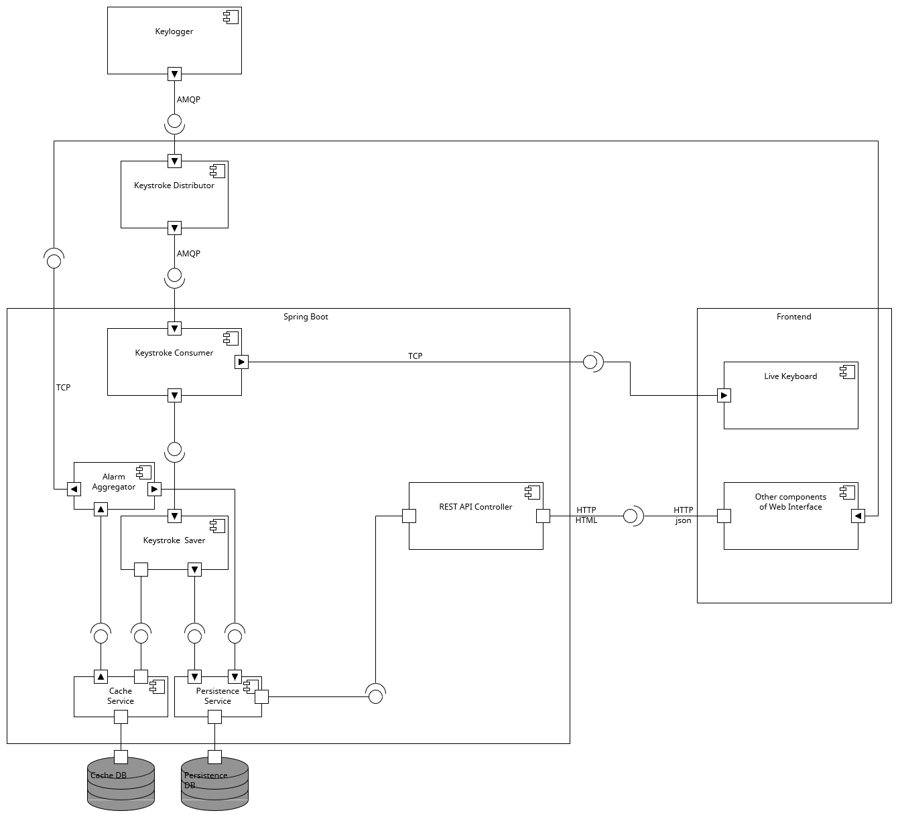

# Project abstract

## Title: *KeyUsageProfiler*

## Description

An app that tracks the usage of keys in a keyboard while giving some users statistics about them in intuitive ways.
Allows for monitoring of multiple users running a keylogger by a team leader. Also detects inactivity and improper activity (such as gaming in work hours) and alerts the team leader about it.

Made for the IES course on school year 23/24

## Project Team

*Team Manager* - Miguel Pinto <miguel.silva48@ua.pt>

*Product Owner* - Ricardo Quintaneiro <ricardoquintaneiro@ua.pt>

*DevOps* - Miguel Figueiredo <miguel.belchior@ua.pt>

*Architect* - João Dourado <joao.dourado1@ua.pt>

## Practices During Development
The following practices were followed:
- Conventional Commit Messages (Feat, Fix, Chore) according to the following [link](https://www.conventionalcommits.org/en/v1.0.0/#specification)
- Feature-branching workflow - Creation of branches and development based on features and division between backend and frontend (usually each issue had one developer for frontend and another for backend). The naming of the branches followed the same approach that was ​taught in theoretical classes (new/ - new feature, imp/ - improvement) with the number of the issue(s) being developed included in the name (as we divided the issues between backend and frontend that distinction is also done).
- Branches:
  - feature-branches: (already mentioned) created according to the needs to implement new features
  - develop: branch from which feature branches are created. For quick fixes direct commits were made on this branch. For each feature a pull request was made to this branch from feature branches to merge the changes (and record history). From this branch we do a pull request to main at each iteration/release. 
  - main: used to mark the releases of each iteration and where the last version is. (For quick fixes direct commits were also made on this branch.)

## Subproject Links
- **Keylogger** - [projSensor](projSensor/) - includes implementation of keylogger and messaging of keystrokes through rabbitmq
- **Backend** - [projBackend](projBackend/) - includes the reception of keystrokes, buffering to redis, notifications, websockets, controllers, persitence services...
- **Frontend** - [projFrontend](projFrontend/) - includes the user interface made in react
- More documentation on each subproject can be found on the README of the respective folder


## How to run

```bash
# clone repository locally
git clone git@github.com:miguel-silva48/KeyUsageProfiler.git; 
cd KeyUsageProfiler;
```

### Running the App

Make sure you have [Docker Compose](https://docs.docker.com/engine/install/) installed.

Uses the following *Docker* images:

- [`mysql:5.7`](https://hub.docker.com/layers/library/mysql/5.7/images/sha256-dab0a802b44617303694fb17d166501de279c3031ddeb28c56ecf7fcab5ef0da?context=explore) - persistence DB
- [`redis:alpine`](https://hub.docker.com/layers/library/redis/alpine/images/sha256-20d2c28fbf8ec97b9ad6eab187d6252b730bf16219c612b77897eb28bab3526f?context=explore) - cache/short-lived data DB
- [`rabbitmq:management`](https://hub.docker.com/layers/library/rabbitmq/management/images/sha256-4e1247e3ae79f16e74df87eea3070f71256e2d5ed770ef0a4bc3f55a30527a1b?context=explore) - message queue
- [`maven:3-openjdk-17`](https://hub.docker.com/layers/library/maven/3-openjdk-17/images/sha256-62e6a9e10fb57f3019adeea481339c999930e7363f2468d1f51a7c0be4bca26d?context=explore) - for running spring framework
- [`node:18-alpine`](https://hub.docker.com/layers/library/node/18-alpine/images/sha256-8842b060b01af71c082cee310b428a2d825e940d9fd9e450e05d726aea66a480?context=explore) - for running the frontend web application

```bash
docker compose up -d;     # create docker containers
```

Access the frontend at <http://localhost:5173/>. <br>
There is also a [.env](.env) file that you may edit if you chose to change some of the environmental variables.

### Running Keylogger Sensor

Make sure you have both [Maven](https://maven.apache.org/install.html) and [Java 17+](https://openjdk.org/install/) installed. Furthermore, make sure you edit the **USER_ID** in the [.env](projSensor/keylogger_sensor/.env) file to the database id of the user you want to impersonate when producing the keystrokes. If you want to use the deployed version in the IES server change **RABBITMQ_HOST** to "deti-ies-16.ua.pt" (**DISCLAIMER: At this moment in time we had problems with our vm and the STIC didn't fix the issue so that we could deploy there our application. We'll send a mail if at any time the option for deployment is available for us again - that is, if STIC fix the issue**):

```bash
USER_ID=1
RABBITMQ_HOST="localhost"
```

Running directly:

```bash
cd projSensor/keylogger_sensor/;
mvn package;
mvn exec:java -Dexec.mainClass="com.mibef108287.app.App";
```

Packaging into a JAR and running:

```bash
cd projSensor/keylogger_sensor/;
mvn package;
java -jar target/keylogger_sensor-1.0-SNAPSHOT-jar-with-dependencies.jar;
```

## Architecture Diagram



- **Keylogger** - [projSensor](projSensor/)
- **Spring Boot** - [projBackend](projBackend/)
  - **KeystrokeConsumer** - [KeystrokesConsumer.java](projBackend/src/main/java/com/ies2324/projBackend/consumer/KeystrokesConsumer.java)
  - **Alarm Aggregator** - [RedisService](projBackend/src/main/java/com/ies2324/projBackend/services/RedisService.java) handleRedisKeyExpiredEvent method and [NotificationService](projBackend/src/main/java/com/ies2324/projBackend/services/NotificationService.java) createAndSendNotification method
  - **Keystroke Saver** - [KeystrokeSaver](projBackend/src/main/java/com/ies2324/projBackend/services/KeystrokeSaver.java)
  - **Cache Service** - [RedisService](projBackend/src/main/java/com/ies2324/projBackend/services/RedisService.java)
  - **Persistence Service** - almost all services on [Services](projBackend/src/main/java/com/ies2324/projBackend/services)
  - **Rest API Controller** - [Controllers](projBackend/src/main/java/com/ies2324/projBackend/controllers)
- **Frontend** - [projFrontend](projFrontend/)

## Bookmarks

### Management Board

An overall view of the user stories and their status can be found in the following link:

<https://github.com/users/miguel-silva48/projects/1>

### Cloud versions of reports and others

Project_Specification_Report:

<https://docs.google.com/document/d/1QzRJoO-oqjjJ1CPPHerlChldXcHeHqTO6yjKa63GLKo/edit>

Prototype (Figma):

<https://www.figma.com/file/obImDvzy220l7wHxBSFWRW/KeyUsageProfiler?type=design&node-id=0%3A1&mode=design&t=VuI7D2o2buKyOZtO-1>

Presentation:

<https://uapt33090-my.sharepoint.com/:p:/g/personal/miguel_belchior_ua_pt/Ef_fPynL-OtFpRP8IDC1Vl4BPzEYnji-qqcrNiqj78ujZA?e=t7rEqO>

### Entry point to the API documentation

While running the backend service, access the following endpoint:
[http://localhost:8080/swagger-ui/index.html#/](http://localhost:8080/swagger-ui/index.html#/)
